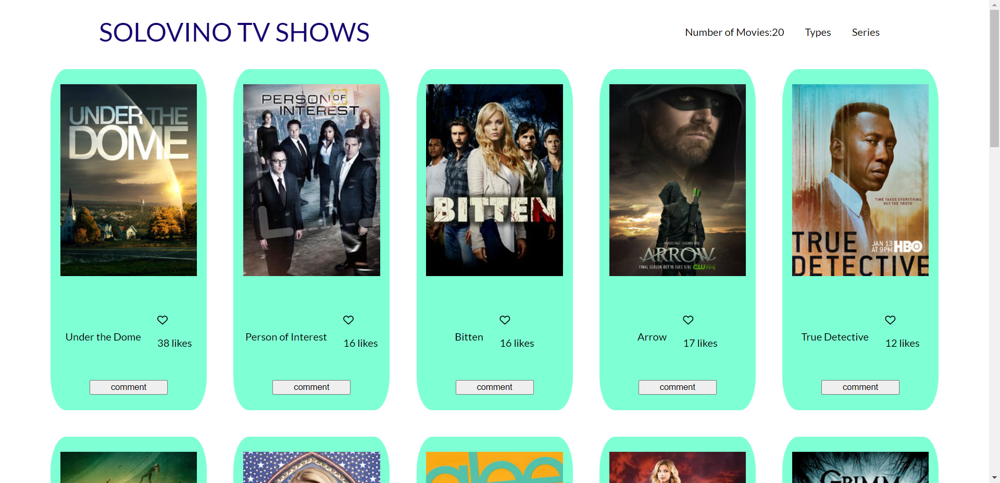

# SOLOVINO TV SHOWS

> This project is a place where you can like and comment your favorites TV Shows.

# Image Preview

## Built With

- JavaScript, CSS, HTML.
- Jest, Babel.
- Visual Studio Code.

## Live Demo (if available)

[Live Demo Link](https://diegomero.github.io/javascript-capstone/dist/)

## Getting Started

To get a local copy up and running follow these simple example steps.

1. Open Git and go to the folder you want to clone this repo.

2. Type git clone git@github.com:DiegoMero/javascript-capstone.git

3. Now you can use this repo.

### Prerequisites

You will only need a working pc.

### Install

Feel free to fork this repo!

## Authors

👤 **Aneal Laryea**

* Github: [@aneallaryea](https://github.com/aneallaryea100)
* LinkdIn: [@aneallaryea](https://www.linkedin.com/in/nii-aneal-84ba7a147)
* Twitter: [@aneallaryea](https://twitter.com/AnealLaryea)

👤 **Diego Mero**

- GitHub: [@githubhandle](https://github.com/DiegoMero)
- Twitter: [@twitterhandle](https://twitter.com/Dimero18)
- LinkedIn: [LinkedIn](https://www.linkedin.com/in/diego-mero-80b326225/)

## 🤝 Contributing

Contributions, issues, and feature requests are welcome!

Feel free to check the [issues page](../../issues/).

## Show your support

Give a ⭐️ if you like this project!

## Acknowledgments
- The images and information in this project is taken from [TVMaze](https://www.tvmaze.com/api).
- We got inspired by the microverse template for this project.

## 📝 License
This project is [MIT](./MIT.md) licensed.
